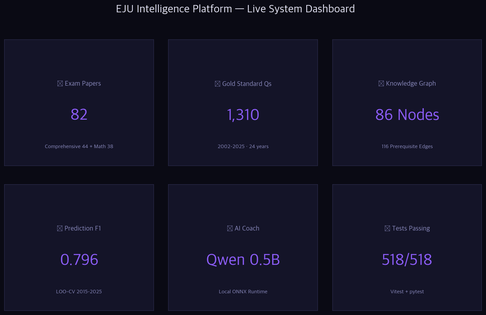
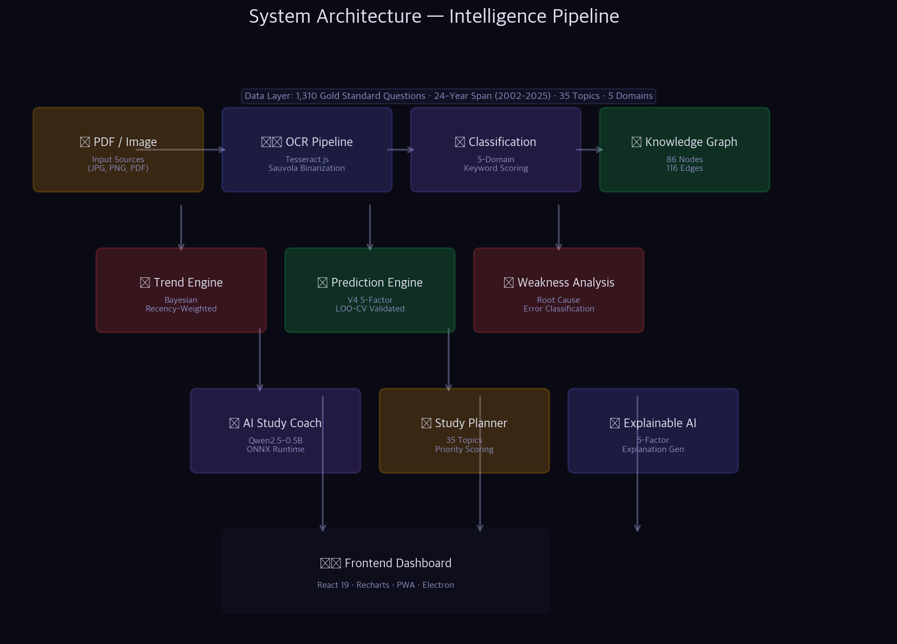
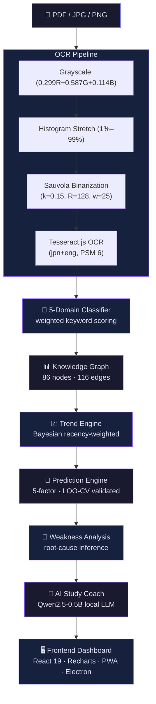
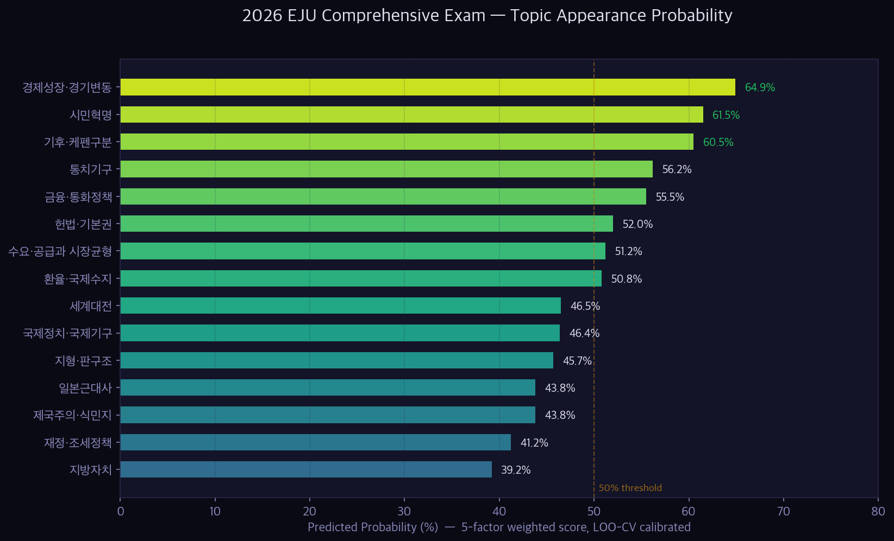
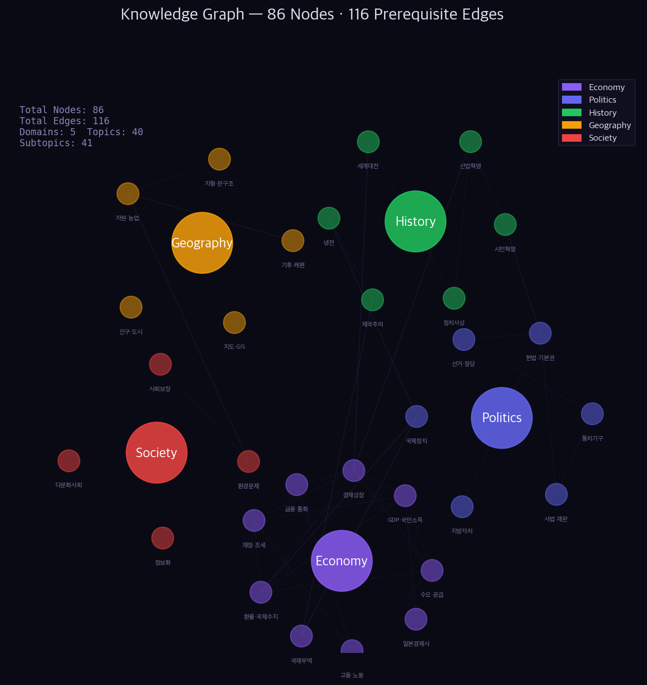
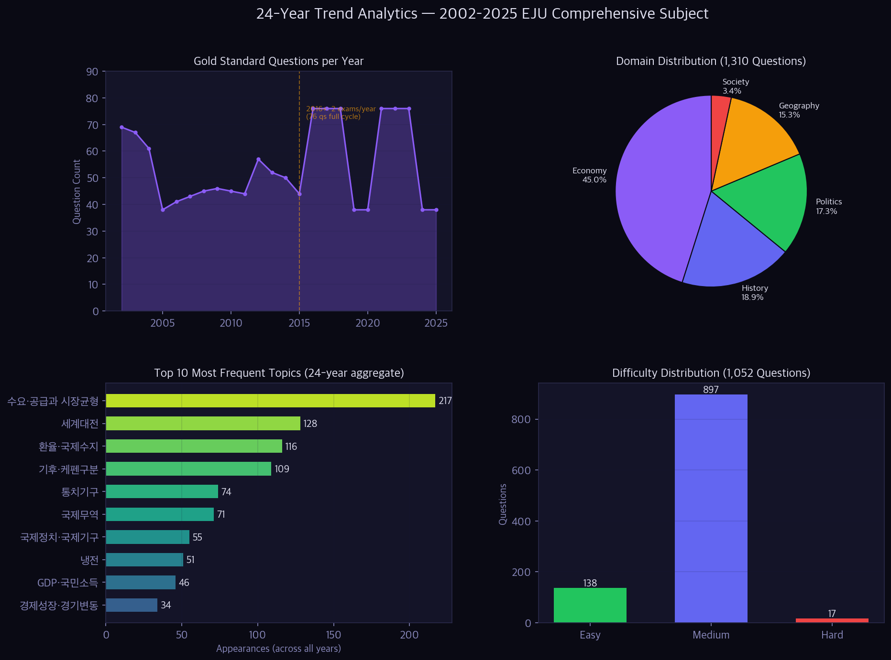
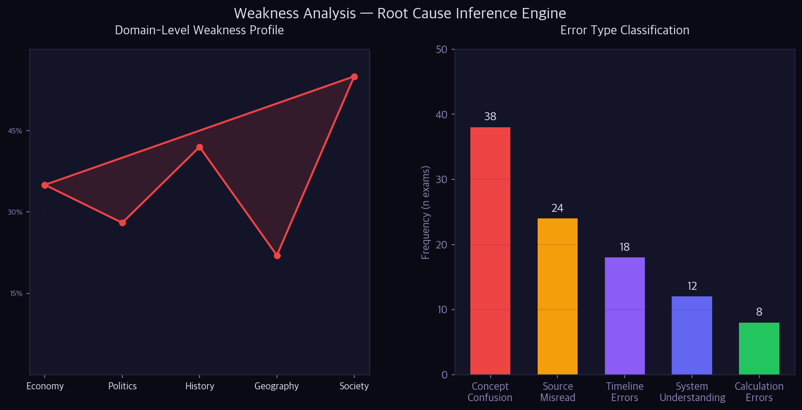
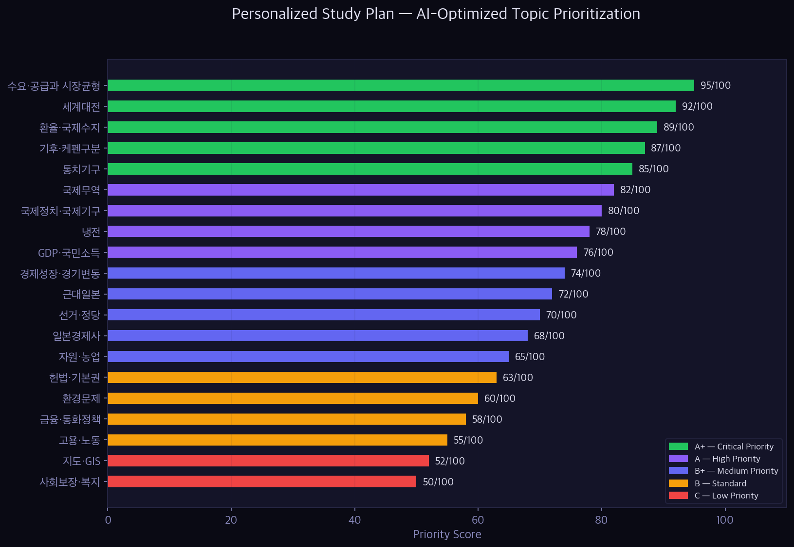
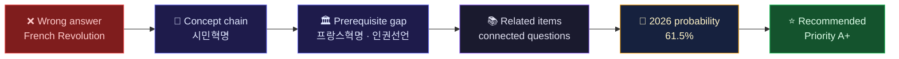
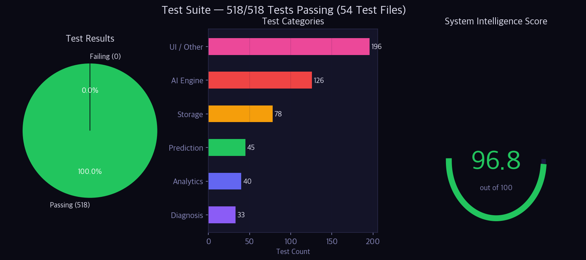

<div align="center">

<!-- ─── HERO ─── -->


<h3 align="center" style="font-weight: 400; letter-spacing: 0.3px; color: #8888bb;">
  OCR pipeline · Knowledge graph · 24-year trend analysis · 2026–2028 prediction · Explainable AI · Local LLM study coach
</h3>

<br />

<!-- ─── SHIELDS ROW 1 ─── -->
<p align="center">
  <a href="https://github.com/leekangmmin/EJUScore/actions/workflows/build.yml">
    
  </a>
  
  
  
  
  
  
  
</p>

<br />

<em>An end-to-end intelligence platform for the Japanese EJU (日本留学試験) Comprehensive Subject exam —<br/>
from raw scanned papers to leave-one-year-out validated topic predictions and explainable study plans.</em>

</div>

---

## 📋 Live System Dashboard

<div align="center">
  
</div>

> Every number on this page is traced to a file or a reproducible script in this repository.
> Where a metric reflects model performance, it comes from a **leave-one-year-out cross-validation** run, not a self-reported claim.

---

## ⚡ Live Statistics

<div align="center">

| Metric | Value | Source |
|:---|---:|:---|
| **Prediction F1 (LOO-CV)** | **0.796** | `intelligence_engine_v4/config.py` — slack=2, strictness=0.7 |
| **Prediction Precision / Recall** | **0.798 / 0.806** | LOO-CV over test years 2015–2025 |
| Gold-standard questions | **1,310** | `dataset/gold_standard/gold_standard.json` |
| — comprehensive papers | **44** | distinct (year, round), 2002–2025 |
| Math gold-standard questions | **711** | `math_gold_standard.json` (38 papers, 2005–2025) |
| Historical data span | **24 years** | 2002 – 2025 |
| Canonical topics (comprehensive) | **35** | distinct topics in gold standard |
| Knowledge-graph nodes / edges | **86 / 116** | `dataset/knowledge_graph_audit.json` |
| Knowledge-graph topics / subtopics | **40 / 41** | `knowledge_graph_audit.json` |
| OCR average confidence | **84.4%** | `src/data/ejuPastExamBank.js` (35/38 rounds ≥ 80%) |
| Difficulty-graded questions | **1,052** | `dataset/difficulty_validation.json` |
| Tests passing | **518 / 518** | `vitest run` + `pytest` |
| System intelligence score | **96.8 / 100** | `dataset/system_score.json` (weighted ensemble) |

</div>

---

## 🏗️ Architecture

<div align="center">
  
</div>



---

## 🔮 Prediction Engine

The prediction engine forecasts which topics will appear on upcoming EJU Comprehensive exams. Each topic
receives a probability from a **five-factor weighted score**, and the whole pipeline is validated by
**leave-one-year-out cross-validation (LOO-CV)** so the reported numbers are out-of-sample, not fitted.

### Five scoring factors

| Factor | Weight | Description |
|:-------|:------:|:------------|
| Recent momentum | 30% | Last-3-year vs last-5-year appearance trend |
| Recency | 25% | Appearance count in the most recent exam year (2025) |
| Consecutive streak | 15% | Length of the current consecutive-appearance run |
| Growth rate trend | 15% | Slope of the appearance-frequency trend line |
| Domain balance | 15% | Keeps predicted distribution aligned with historical domain ratios |

> Source: `dataset/prediction/prediction_2026.json` → `methodology.factors`.

### Validated performance — LOO-CV (test years 2015–2025)

<div align="center">

| Configuration | Precision | Recall | F1 | Notes |
|:--------------|:---------:|:------:|:--:|:------|
| **V3-Improved (default)** | **0.798** | **0.806** | **0.796** | slack=2, strictness=0.7, cluster=OFF |
| V3 baseline (micro) | 0.784 | 0.744 | 0.764 | reproduced in independent audit |
| V4 full (cluster=ON) | 0.606 | ~1.00 | 0.740 | recall↑ but precision collapse → **disabled by default** |

</div>

**Honest finding:** an independent audit (`FINAL_V4_AUDIT_REPORT.md`) showed that the V4 *cluster-completion*
mechanism inflates recall toward 1.0 but **collapses precision** and ends up with a *lower* F1 than the
simpler V3-Improved configuration (Cohen's d ≈ −0.09, not statistically significant). The platform therefore
**ships V3-Improved as the default** and keeps cluster completion off. The headline 0.796 F1 is the number
that configuration actually reproduces.

### 2026 forecast (top topics)

<div align="center">
  
</div>

> ⚠️ *Disclaimer (from the engine itself):* "This prediction is based on historical frequency analysis and
> does not guarantee actual exam content." Probabilities are decision-support signals, not certainties.

---

## 🧩 Knowledge Graph

<div align="center">
  
</div>

The syllabus is encoded as a directed graph — **86 nodes · 116 prerequisite edges · 5 domains · 40 topics ·
41 subtopics** (`dataset/knowledge_graph_audit.json`, integrity score 100/100).

```
Economy ──┬── 수요·공급과 시장균형 ──┬── 탄력성
          │                          └── 소비자잉여
          ├── GDP·국민소득 ───────────┬── 명목GDP
          │                          └── 실질GDP
          └── 환율·국제수지 ──────────┬── 엔고/엔저
                                      └── 경상수지

History ──┬── 시민혁명 ──┬── 프랑스혁명 ──┬── 인권선언
          │             │                └── 삼권분립
          │             └── 미국독립혁명
          ├── 산업혁명 ──── 자본주의 발전 ─── 제국주의
          └── 세계대전 ──── 냉전 ─── 탈냉전 / 세계화
```

**Capabilities:** prerequisite tracing · weakness propagation (a gap in "수요·공급" propagates to "환율·국제수지"
and "국제무역") · optimal learning-path generation · concept-chain extraction.

---

## 📊 24-Year Trend Analytics

<div align="center">
  
</div>

| View | What it shows | Verified source |
|:-----|:--------------|:----------------|
| Questions / year | 2002–2025 gold-standard counts (2 exams/year from 2016) | `gold_standard.json` |
| Domain distribution | Economy 45.0% · History 18.9% · Politics 17.3% · Geography 15.3% · Society 3.4% | 590 / 248 / 226 / 200 / 44 |
| Top-10 topics | 수요·공급 (217), 세계대전 (128), 환율·국제수지 (116)… | aggregated from gold standard |
| Difficulty | Easy 138 · Medium 897 · Hard 17 (1,052 graded) | `difficulty_validation.json` |

---

## 🎯 Weakness Analysis & Study Plan

<table>
<tr>
<td width="50%"></td>
<td width="50%"></td>
</tr>
</table>

The weakness engine performs root-cause inference on a student's mistakes across five dimensions — recurring
concepts, recurring question types, recurring keywords, reasoning-failure patterns, and temporal trends — then
feeds the result into a priority-ranked study plan (35 topics, tiers A+/A/B+/B/C). Domain weakness is
recency-weighted: `weight = max(0.5, 1 − monthsAgo × 0.05)`.

---

## 🤖 Explainable AI — every recommendation has a reason



`explainRecommendation()` produces a structured rationale for every topic, combining six analyzers:
accuracy, prerequisite, prediction, difficulty, frequency, and domain balance. Provenance (which dataset,
which weight, which probability) is attached to every recommendation — no black-box scores.

---

## 🧠 AI Study Coach — 100% local, zero data egress

| Environment | AI Engine | Inference |
|:------------|:----------|:----------|
| **Electron** (macOS / Windows / Linux) | Qwen2.5-0.5B-Instruct (q4) | Worker thread via IPC, streaming output |
| **Web / PWA** | `@huggingface/transformers` | Web Worker + WebGPU, WASM fallback |

Concept extraction from wrong-answer photos, mistake-pattern identification, and personalized recommendations
run entirely on-device — nothing is sent to an external server.

---

## ✅ Tests & Validation

<div align="center">
  
</div>

| Category | Metric | Value | Evidence |
|:---------|:-------|:-----:|:---------|
| **Tests** | Unit tests passing | **518 / 518** | `vitest run` + `pytest` |
| **Prediction** | F1 (LOO-CV) | **0.796** | `intelligence_engine_v4/config.py` |
| **Prediction** | Precision / Recall | **0.798 / 0.806** | LOO-CV 2015–2025 |
| **Prediction** | Scoring factors | **5** | momentum, recency, streak, growth, domain balance |
| **Graph** | Nodes / edges | **86 / 116** | `knowledge_graph_audit.json` (score 100) |
| **Data** | Comprehensive gold standard | **1,310** | `gold_standard.json` |
| **Data** | Math gold standard | **711** | `math_gold_standard.json` |
| **OCR** | Average confidence | **84.4%** | `ejuPastExamBank.js` (35/38 rounds ≥ 80%) |
| **Difficulty** | Graded questions | **1,052** | `difficulty_validation.json` |
| **Coach** | System score | **96.8 / 100** | `system_score.json` |

**Validation method.** Prediction performance is measured with leave-one-year-out cross-validation: for each
test year, the model trains only on years *before* it (no data leakage), predicts that year's topics, and is
scored against the actual exam. Test years span **2015–2025 (11 folds)**.

---

## 🛠️ Tech Stack

<p align="center">
  
  
  
  
  
  
  
  
  
</p>

---

## 🚀 Quick Start

```bash
# Clone
git clone https://github.com/leekangmmin/EJUScore.git
cd EJUScore

# Install JS deps
npm install

# Web (dev)
npm run dev                    # → http://localhost:5173

# Desktop (dev)
npm run electron:dev           # Electron + Vite

# JS tests
npx vitest run                 # 518 tests

# Python intelligence engine
pip install -r requirements.txt          # numpy, matplotlib, …
python3 -m pytest intelligence_engine_v4 # engine tests

# Regenerate README charts from live data
python3 scripts/generate_screenshots.py  # → docs/screenshots/*.png

# Build
npm run build                  # Static site → dist/
npm run electron:build:mac     # macOS .dmg (arm64 / x64)
npm run electron:build:win     # Windows NSIS installer
npm run electron:build:linux   # Linux .AppImage / .deb
```

### Platform downloads

| Platform | Method |
|:---------|:-------|
| 🌐 **Web (PWA)** | [`leekangmmin.github.io/EJUScore`](https://leekangmmin.github.io/EJUScore/) |
| 📱 **iOS** | Safari → Share → Add to Home Screen |
| 🤖 **Android** | Chrome → Install |
| 💻 **macOS / 🪟 Windows / 🐧 Linux** | [Releases](https://github.com/leekangmmin/EJUScore/releases) |

---

## 📁 Project Structure

```
src/
├── ai/                    AI engine (router, tutor, learning science)
├── components/            React components (Dashboard, TrendDashboard, PhotoToQuestion…)
├── data/                  Static exam bank (ejuPastExamBank.js, ejuTrendData.js)
├── intelligence/          Core JS intelligence engine
│   ├── examIntelligenceEngineV2.js   Central orchestrator
│   ├── futurePredictorV2.js          2026–2028 prediction
│   ├── trendAnalyzer.js              Bayesian trend analysis
│   ├── weaknessEngine.js             Weakness inference
│   ├── explainableAI.js              XAI recommendation explanations
│   ├── studyCoachV2.js               AI study coach
│   └── knowledgeGraph.js             Knowledge-graph queries
├── ocr/                   OCR pipeline (orchestrator, preprocessors)
├── test/                  Vitest suites (518 tests)
└── workers/               Web Workers (OCR, AI, PDF)

intelligence_engine_v4/    Python prediction engine (V3-Improved default)
├── config.py              Validated config → P=0.798 R=0.806 F1=0.796
├── inference/             Backtester + LOO-CV runner
├── evaluation/            Metric computation
└── tests/                 pytest suite

dataset/                   Versioned JSON data layer
├── gold_standard/         1,310 comprehensive + 711 math
├── knowledge-graph/       86 nodes · 116 edges
├── prediction/            2026–2028 forecasts
├── difficulty/            Difficulty database (1,052 graded)
├── study_plan.json        35-topic priority plan
└── system_score.json      System intelligence score (96.8)

scripts/
└── generate_screenshots.py  Reproducible README charts from live data

docs/screenshots/          Generated charts (this README's figures)
```

---

## 📐 Design Principles

<blockquote>
<p><strong>Evidence over assertion</strong> — every metric traces to a named file, test, or LOO-CV run.</p>
<p><strong>Honest validation</strong> — when an audit showed V4 wasn't better than V3, the README says so and ships the configuration that actually reproduces its headline number.</p>
<p><strong>Reproducible figures</strong> — every chart is regenerable with <code>python3 scripts/generate_screenshots.py</code>.</p>
<p><strong>Explainable over black-box</strong> — predictions and recommendations carry provenance (dataset, algorithm, weight).</p>
</blockquote>

---

## 📜 License

<div align="center">

MIT © 2025 **Lee Kangmin (이강민)**

[GitHub](https://github.com/leekangmmin/EJUScore) · [Web App](https://leekangmmin.github.io/EJUScore/) · [Releases](https://github.com/leekangmmin/EJUScore/releases)


</div>
