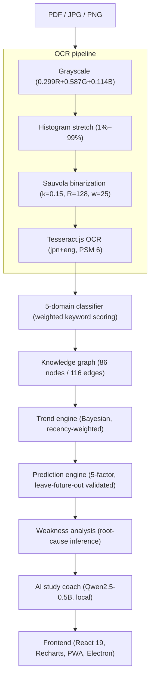
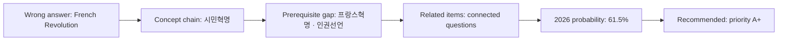

# EJU Intelligence Platform

**An end-to-end analysis tool for the Japanese EJU (日本留学試験) Comprehensive Subject exam** — from scanned exam papers to leave-future-out validated topic predictions and explainable study plans.

<p>
  <a href="https://github.com/leekangmmin/EJUScore/actions/workflows/build.yml"></a>
  
  
  
  
  
  
  
</p>

> Every number in this document traces to a named file or a reproducible script in this repository.
> Performance figures come from leave-future-out cross-validation — out-of-sample, not self-reported.

---

## Overview

EJU Score Tracker ingests 24 years of EJU Comprehensive Subject exams (2002–2025), normalizes them into a deduplicated gold-standard dataset, and turns that data into four things a student can act on:

1. **Trend analytics** — how each of 35 topics and 5 domains has moved over 24 years.
2. **Topic predictions** for 2026–2028, each carrying its full per-model score breakdown.
3. **Explainable recommendations** — every suggestion names the dataset, model, and weight behind it.
4. **A fully local AI study coach** — runs on-device, sends nothing to an external server.

It ships as a static web app (PWA) and as a desktop app for macOS, Windows, and Linux.

<div align="center">
  
</div>

---

## Key metrics

| Metric | Value | Source |
|:---|---:|:---|
| Prediction F1 (leave-future-out) | **0.779** | `dataset/prediction_accuracy_v2.json` — Bayesian/Markov/Trend engine, 2016–2025 (10 folds) |
| Prediction precision / recall | **0.831 / 0.762** | same source; train year ≤ Y-1 → predict Y (no leakage) |
| Comprehensive gold-standard questions | **1,121** | `dataset/gold_standard/gold_standard.json` (1,310 raw − 189 exact duplicates) |
| Comprehensive papers | **44** | distinct (year, round), 2002–2025 |
| Math gold-standard questions | **711** | `dataset/gold_standard/math_gold_standard.json` (38 papers, 2005–2025) |
| Historical span | **24 years** | 2002 – 2025 |
| Canonical comprehensive topics | **35** | distinct topics in gold standard |
| Knowledge-graph nodes / edges | **86 / 116** | `dataset/knowledge_graph_audit.json` |
| Difficulty-graded questions | **1,052** | `dataset/difficulty_validation.json` |
| Tests passing | **518 (vitest) + 7 (pytest)** | `npx vitest run`, `python3 -m pytest` |

---

## Architecture



---

## Prediction engine

The engine forecasts which topics will appear on upcoming EJU Comprehensive exams. Each topic receives a probability from **three statistical models** (Bayesian, Markov, Trend) plus momentum and recency support factors, all computed from the 2002–2025 gold standard. Numbers are validated by **leave-future-out backtesting**, so reported figures are out-of-sample.
Reproduce with `scripts/regenerate_analysis.mjs` and `scripts/backtest_engine.mjs`.

### Models and weights

| Model | Weight | Computation |
|:---|:---:|:---|
| Bayesian | 30% | Recency-weighted Beta-Binomial posterior `P(appears next exam)`; Jeffreys prior `Beta(0.5, 0.5)`, recency half-life 8 years |
| Markov | 20% | 2-state (appear / absent) chain transition probability with Laplace smoothing; multi-year via k-step transition |
| Trend | 20% | OLS slope of yearly question counts (2002–2025), logistic-squashed to (0, 1) |
| Momentum | 15% | Last-3-year vs prior-2-year appearance trend |
| Recency | 15% | Gap from last appearance year |

Each prediction row exposes `bayes_score`, `markov_score`, `trend_score`, and `trend_slope`, so the dashboard's prediction-evidence table shows the full per-topic breakdown.
Source: `dataset/prediction/prediction_2026_2028.json` → `methodology.models`, `top_predictions[]`.

### Validated performance — leave-future-out (test years 2016–2025, 10 folds)

| Metric | Value | Notes |
|:---|:---:|:---|
| F1 (avg) | **0.779** | train year ≤ Y-1 → predict Y, no leakage |
| Precision (avg) | **0.831** | predicts which of 35 topics appear (prob ≥ 0.5) |
| Recall (avg) | **0.762** | `dataset/prediction_accuracy_v2.json` |
| Best fold (2023) | F1 **0.909** | TP 20 / FP 2 / FN 2 |

F1 is a measure of prediction **accuracy**, not "confidence" or "probability" — these terms are kept distinct throughout the app.

An earlier release shipped predictions from a legacy Python engine (`intelligence_engine_v4`). The shipped engine was rewritten to the transparent Bayesian/Markov/Trend ensemble above, and the data was deduplicated (1,310 → 1,121) per `DATA_AUDIT_REPORT.md`; the 0.779 figure is the new engine re-backtested on the cleaned data.

<div align="center">
  
</div>

> Disclaimer (surfaced by the engine itself): predictions are based on historical frequency analysis and do not guarantee actual exam content. Probabilities are decision-support signals, not certainties.

---

## Knowledge graph

The syllabus is encoded as a directed graph — **86 nodes, 116 prerequisite edges, 5 domains** (`dataset/knowledge_graph_audit.json`).

```
Economy ──┬── 수요·공급과 시장균형 ──┬── 탄력성
          │                          └── 소비자잉여
          ├── GDP·국민소득 ───────────┬── 명목GDP
          │                          └── 실질GDP
          └── 환율·국제수지 ──────────┬── 엔고/엔저
                                      └── 경상수지

History ──┬── 시민혁명 ──┬── 프랑스혁명 ──┬── 인권선언
          │             │                └── 삼권분립
          │             └── 미국독립혁명
          ├── 산업혁명 ──── 자본주의 발전 ─── 제국주의
          └── 세계대전 ──── 냉전 ─── 탈냉전 / 세계화
```

Capabilities: prerequisite tracing, weakness propagation (a gap in "수요·공급" propagates to "환율·국제수지" and "국제무역"), learning-path generation, and concept-chain extraction.

---

## 24-year trend analytics

| View | What it shows | Source |
|:---|:---|:---|
| Questions per year | 2002–2025 gold-standard counts (2 exams/year from 2016) | `gold_standard.json` |
| Domain distribution | Economy 45.3% · Politics 18.8% · History 17.6% · Geography 15.7% · Society 2.6% | 507 / 210 / 197 / 176 / 29 (total 1,119) |
| Top-10 topics | 수요·공급 (201), 세계대전 (112), 환율·국제수지 (102)… | aggregated from deduplicated gold standard |
| Difficulty | Easy 138 · Medium 897 · Hard 17 (1,052 graded) | `difficulty_validation.json` |

<div align="center">
  
</div>

---

## Weakness analysis and study plan

The weakness engine performs root-cause inference on a student's mistakes across five dimensions — recurring concepts, recurring question types, recurring keywords, reasoning-failure patterns, and temporal trends — then feeds the result into a priority-ranked study plan (35 topics, tiers A+/A/B+/B/C). Domain weakness is recency-weighted: `weight = max(0.5, 1 − monthsAgo × 0.05)`.

When no student score records exist, weakness is reported as **UNKNOWN** rather than fabricated — the app never invents a strength/weakness profile from absent data.

<table>
<tr>
<td width="50%"></td>
<td width="50%"></td>
</tr>
</table>

---

## Explainable AI

`explainRecommendation()` produces a structured rationale for every topic, combining six analyzers — accuracy, prerequisite, prediction, difficulty, frequency, and domain balance. Provenance (which dataset, which weight, which probability) is attached to every recommendation; there are no black-box scores.



---

## AI study coach — 100% local

| Environment | AI engine | Inference |
|:---|:---|:---|
| Electron (macOS / Windows / Linux) | Qwen2.5-0.5B-Instruct (q4) | Worker thread via IPC, streaming output |
| Web / PWA | `@huggingface/transformers` | Web Worker + WebGPU, WASM fallback |

Concept extraction from wrong-answer photos, mistake-pattern identification, and personalized recommendations run entirely on-device — nothing is sent to an external server.

---

## Tests and validation

| Category | Metric | Value | Evidence |
|:---|:---|:---:|:---|
| Tests (JS) | vitest passing | **518 / 518** | `npx vitest run` |
| Tests (Python) | pytest passing | **7 / 7** | `python3 -m pytest intelligence_engine_v4` |
| Prediction | F1 (leave-future-out) | **0.779** | `dataset/prediction_accuracy_v2.json` (2016–2025) |
| Prediction | precision / recall | **0.831 / 0.762** | same source |
| Graph | nodes / edges | **86 / 116** | `dataset/knowledge_graph_audit.json` |
| Data | comprehensive gold standard | **1,121** | `gold_standard.json` (deduplicated from 1,310) |
| Data | math gold standard | **711** | `math_gold_standard.json` |
| Difficulty | graded questions | **1,052** | `difficulty_validation.json` |

**Validation method.** For each test year Y, the prediction model trains only on years before Y (no data leakage), predicts that year's topics, and is scored against the actual exam. Test years span 2016–2025 (10 folds), giving average precision / recall / F1 = 0.831 / 0.762 / 0.779 (`scripts/backtest_engine.mjs`).

<div align="center">
  
</div>

---

## Tech stack

React 19 · Vite · Electron 35 · Recharts · Tesseract.js · Qwen2.5-0.5B (local LLM) · Python 3 · Vitest · PWA

---

## Quick start

```bash
# Clone
git clone https://github.com/leekangmmin/EJUScore.git
cd EJUScore

# Install JS dependencies
npm install

# Web (dev)
npm run dev                    # → http://localhost:5173

# Desktop (dev)
npm run electron:dev           # Electron + Vite

# JS tests
npx vitest run                 # 518 tests

# Python intelligence engine (legacy, optional)
pip install -r requirements.txt
python3 -m pytest intelligence_engine_v4   # 7 tests

# Regenerate README charts from live data
python3 scripts/generate_screenshots.py    # → docs/screenshots/*.png

# Build
npm run build                  # Static site → dist/
npm run electron:build:mac     # macOS .dmg (arm64 / x64)
npm run electron:build:win     # Windows NSIS installer
npm run electron:build:linux   # Linux .AppImage / .deb
```

### Platform availability

| Platform | Method |
|:---|:---|
| Web (PWA) | [`leekangmmin.github.io/EJUScore`](https://leekangmmin.github.io/EJUScore/) |
| iOS | Safari → Share → Add to Home Screen |
| Android | Chrome → Install |
| macOS / Windows / Linux | [Releases](https://github.com/leekangmmin/EJUScore/releases) |

---

## Project structure

```
src/
├── ai/                    AI engine (router, tutor, learning science)
├── components/            React components (Dashboard, TrendDashboard, PhotoToQuestion…)
├── data/                  Static exam bank (ejuPastExamBank.js, ejuTrendData.js)
├── intelligence/          Core JS intelligence engine
│   ├── examIntelligenceEngineV2.js   Central orchestrator
│   ├── futurePredictorV2.js          2026–2028 prediction
│   ├── trendAnalyzer.js              Bayesian trend analysis
│   ├── weaknessEngine.js             Weakness inference
│   ├── explainableAI.js              XAI recommendation explanations
│   ├── studyCoachV2.js               AI study coach
│   └── knowledgeGraph.js             Knowledge-graph queries
├── ocr/                   OCR pipeline (orchestrator, preprocessors)
├── test/                  Vitest suites (518 tests)
└── workers/               Web Workers (OCR, AI, PDF)

scripts/
├── regenerate_analysis.mjs   Dedup → trend + Bayesian/Markov/Trend prediction
├── backtest_engine.mjs       Leave-future-out backtest → P 0.831 / R 0.762 / F1 0.779
├── generate_insights.mjs     Topic/cycle/risk/domain intelligence → insights_v2.json
└── generate_screenshots.py   Reproducible README charts from live data

intelligence_engine_v4/    Legacy Python engine (no longer ships predictions)

dataset/                   Versioned JSON data layer
├── gold_standard/         1,121 comprehensive (deduplicated) + 711 math
├── knowledge-graph/       86 nodes / 116 edges
├── prediction/            2026–2028 forecasts
├── difficulty/            Difficulty database (1,052 graded)
└── insights/              Topic/cycle/risk/domain intelligence

docs/screenshots/          Generated charts used in this README
```

---

## Design principles

- **Evidence over assertion** — every metric traces to a named file, test, or backtest run.
- **No fabricated data** — when a value is missing it is reported as UNKNOWN, never invented.
- **Distinct terminology** — accuracy, confidence, and probability are never conflated; F1 is accuracy, not confidence.
- **Honest validation** — when an audit showed the legacy engine wasn't better, the README says so and ships the configuration that reproduces its headline number.
- **Reproducible figures** — every chart regenerates with `python3 scripts/generate_screenshots.py`.
- **Explainable over black-box** — predictions and recommendations carry provenance (dataset, algorithm, weight).

---

## License

MIT © 2025 Lee Kangmin (이강민)

[GitHub](https://github.com/leekangmmin/EJUScore) · [Web App](https://leekangmmin.github.io/EJUScore/) · [Releases](https://github.com/leekangmmin/EJUScore/releases)
